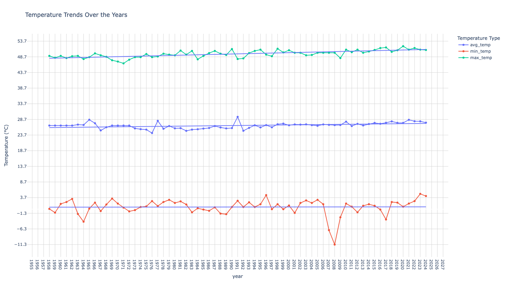

# Global Temperature Analysis

This project analyzes temperature trends across various locations over the past century and predicts future trends based on historical data.

## Overview

Every summer, we find ourselves saying that this year feels hotter than the last. I wanted to see if there’s any truth to that, so I decided to dig into the data and create a graph. For example, over the past 66 years in Kuwait, the trend line for maximum temperatures has climbed from 48.23°C to 51.04°C. That's an increase of 2.81°C in annual maximum temperatures. It might not seem like a huge difference at first, but it’s a significant and worrying change that has serious implications for our environment, health, and economy.



## Data

- `all_data.csv`: Contains daily temperature data for various locations.
- `stations.csv`: Contains information about all weather stations used.

## Setup

1. Clone the repository:
    ```bash
    git clone https://github.com/yourusername/global-temperature-analysis.git
    cd global-temperature-analysis
    ```

2. Create a virtual environment and install dependencies:
    ```bash
    python -m venv venv
    source venv/bin/activate  # On Windows use `venv\Scripts\activate`
    pip install -r requirements.txt
    ```

## Usage

1. **Run the analysis**:
    ```bash
    python main.py
    ```

    By default, this will process data for the station with ID '40582' (Kuwait). To analyze data for a different location, modify the `station_id` variable in `main.py`.

## Files

- `main.py`: Main script to run the data processing and plot generation.
- `src/data_processing.py`: Script to download and preprocess the temperature data.
- `src/plot_generation.py`: Script to generate the temperature trend plot.

## Requirements

- pandas
- plotly
- statsmodels
- meteostat
- numpy
- kaleido

Install these dependencies using the provided `requirements.txt`.

## License

This project is licensed under the MIT License.
